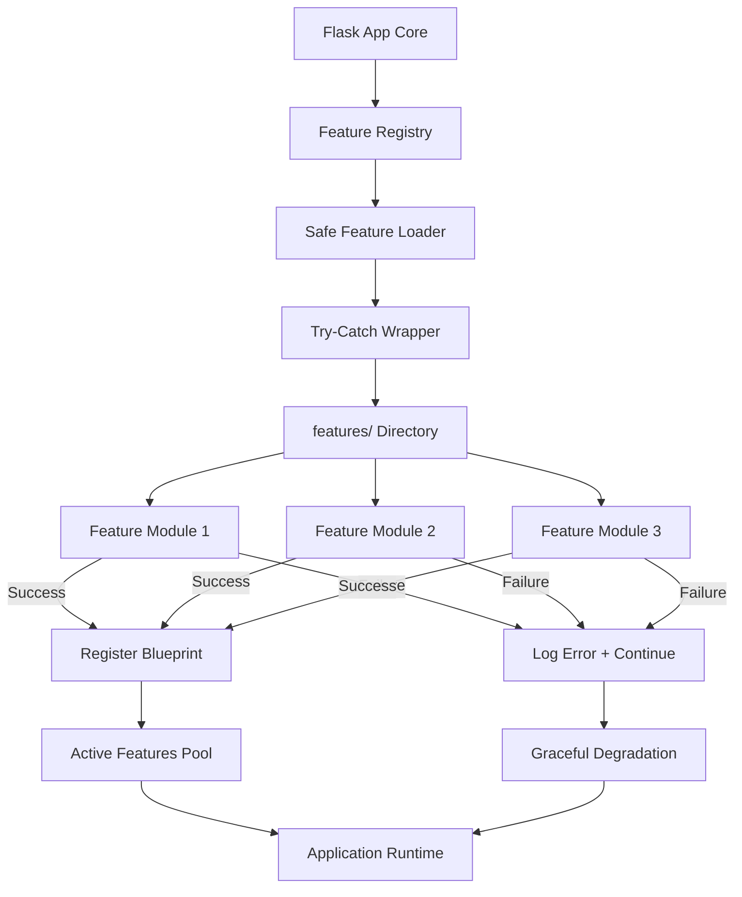
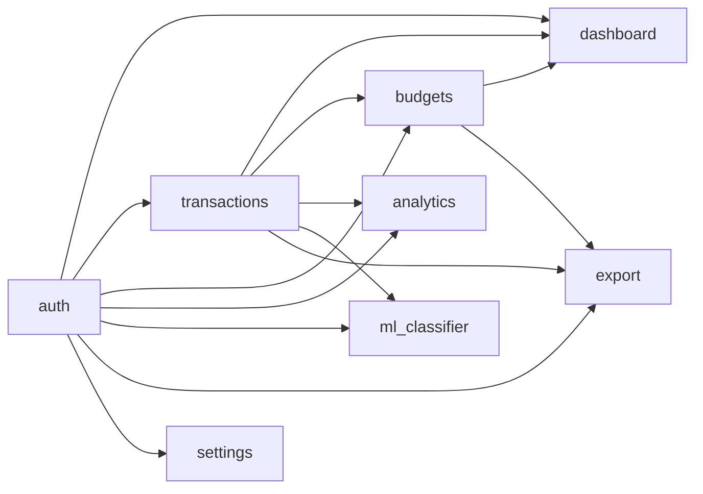

# Money Matrix - Commercial-Grade Personal Finance Platform
## Product Design Document

## Product Vision

Money Matrix is a commercial-grade, web-based personal finance management platform designed to be **100% free at launch** with zero paywalls, premium blockers, or usage limitations. The product delivers a premium fintech experience that rivals paid solutions while remaining accessible to all users.

**Core Philosophy**: "A premium fintech app that doesn't act premium — it just works."

**Launch Promise**:
- Zero cost to use all features
- No feature restrictions
- No time limitations
- No forced upgrades
- Commercial-polish user experience
- Instant value within 60 seconds of first use

**Technology Foundation**: Python-based web application with Firebase Authentication, SQLite persistent storage, and fail-safe modular architecture designed for reliability, speed, and aesthetic excellence.

## Design Objectives

### Mission-Critical Goals

1. **Launch-Ready Quality**: Every feature must be production-ready, fully functional, with zero placeholders or demo buttons
2. **Fail-Safe Architecture**: Removing any feature file cannot crash the application - system must self-heal and continue
3. **60-Second Usability**: New users must understand login, add transactions, view analytics, track budgets, and gain insights within 60 seconds without instruction
4. **Zero-Cost Operations**: All core functionality operates on free-tier infrastructure (Firebase Free, SQLite local, Chart.js free)
5. **Premium Minimalist UX**: Commercial-polish interface inspired by Glassmorphism + Neumorphism with fluid animations
6. **Plug-and-Play Features**: Drop files into features/ folder to add functionality - remove files to disable
7. **Investor-Presentable**: Code quality, UI polish, and functionality suitable for investor demonstrations
8. **Scalable Foundation**: Architecture supports millions of users with future freemium potential

### Technical Excellence Standards

| Standard | Requirement | Success Metric |
|----------|-------------|----------------|
| Performance | Page load < 2 seconds | Measured with Lighthouse |
| Reliability | 99.9% uptime on free tier | Zero crashes in testing |
| Security | Token-verified requests, SQL injection prevention | Passes OWASP Top 10 |
| Accessibility | WCAG 2.1 AA compliance | Keyboard navigation, screen readers |
| Mobile-First | Responsive on all devices | iPhone SE to 4K displays |
| Code Quality | Clean, documented, testable | 80%+ test coverage |

### Explicit Non-Goals

- Paid features at launch (100% free release)
- Experimental or unstable dependencies
- Heavy UI frameworks that reduce performance
- Complex user journeys requiring tutorials
- External paid SaaS dependencies
- Feature overload - simplicity over complexity

## System Architecture

### Technology Stack (100% Free Tier)

**Backend Framework**: Flask or FastAPI (high-performance Python web framework)

**Rationale**: Flask chosen for modularity and lightweight footprint; FastAPI alternative for async performance if needed

**Core Python Libraries** (All Free/Open Source):

| Library | Version | Purpose | License |
|---------|---------|---------|--------|
| Flask | 2.3+ | Web framework, routing, Jinja2 templates | BSD-3-Clause |
| firebase-admin | 6.0+ | Firebase Auth server-side SDK | Apache 2.0 |
| SQLAlchemy | 2.0+ | SQLite ORM for local persistence | MIT |
| Marshmallow | 3.19+ | Data validation and serialization | MIT |
| pandas | 2.0+ | Data analysis, aggregations, reports | BSD-3-Clause |
| numpy | 1.24+ | Numerical computations for analytics | BSD-3-Clause |
| scikit-learn | 1.3+ | ML transaction classification | BSD-3-Clause |
| joblib | 1.3+ | ML model persistence | BSD-3-Clause |
| Flask-CORS | 4.0+ | Cross-origin resource sharing | MIT |
| python-dotenv | 1.0+ | Environment variable management | BSD-3-Clause |
| Werkzeug | 2.3+ | WSGI utilities, security | BSD-3-Clause |

**Frontend Technologies** (Zero External Dependencies):

| Technology | Purpose | Cost |
|------------|---------|------|
| HTML5 | Semantic markup | Free |
| CSS3 | Glassmorphism + Neumorphism styling | Free |
| Vanilla JavaScript (ES6+) | Dynamic interactions, no jQuery | Free |
| Fetch API | Asynchronous data loading | Free (native) |
| Chart.js | Data visualization (pie, line, bar) | Free (MIT) |
| CSS Animations | Smooth transitions, micro-interactions | Free (native) |
| Intersection Observer API | Scroll-based animations | Free (native) |

**Authentication**: Firebase Authentication Free Tier
- Email/Password authentication
- Google Sign-In OAuth
- Password reset via email
- 50,000 monthly active users (free)
- Token verification via firebase-admin SDK

**Database**: SQLite (100% Free, No Limits)
- Local file-based database
- Zero hosting costs
- ACID compliant
- Portable (single .db file)
- No connection limits
- Perfect for single-user finance app
- Encrypted at rest option

**Hosting Options** (Free Tier Deployment):
- Render.com (Free tier: 512MB RAM, auto-sleep)
- Railway.app (Free tier: $5 credit/month)
- PythonAnywhere (Free tier: 1 web app)
- Vercel (Free tier: unlimited projects)
- Local deployment (zero cost)

**Cost Analysis**:

| Component | Free Tier Limit | Paid Upgrade Needed At |
|-----------|----------------|------------------------|
| Firebase Auth | 50K MAU | 50,001 users |
| SQLite | Unlimited | Never (local file) |
| Hosting | Varies by provider | Traffic/compute limits |
| Chart.js | Unlimited | Never (MIT license) |
| ML Models | Local computation | Never (runs on server) |

**Total Launch Cost**: $0/month for up to 50,000 users

### Fail-Safe Modular Architecture

The system implements a **Self-Healing Plugin Architecture** where features are completely decoupled:



**Architecture Principles**:

1. **Isolated Failure Domains**: Each feature loads independently with try-catch isolation
2. **No Cascading Failures**: One feature failure cannot prevent other features from loading
3. **Graceful Degradation**: Missing features result in disabled UI elements, not crashes
4. **Self-Discovery**: Features auto-register at startup by scanning features/ directory
5. **Zero Configuration**: No manual registration - just drop files and restart
6. **Dependency Resilience**: Missing dependencies logged as warnings, not fatal errors

### Core Application Components

#### 1. Flask Application Core (app.py)

**Purpose**: Minimal, robust application bootstrap that orchestrates feature loading

**Responsibilities**:
- Initialize Flask app with security configurations
- Load environment variables (Firebase credentials, secret keys)
- Initialize Firebase Admin SDK for token verification
- Initialize SQLite database connection via SQLAlchemy
- Register global error handlers (404, 500, generic exceptions)
- Set up CORS for API endpoints
- Configure Jinja2 template engine with security settings
- Serve static files (CSS, JS, images)
- Register middleware for authentication verification
- Invoke feature loader to discover and register features

**Startup Sequence**:
1. Load .env file with python-dotenv
2. Initialize Firebase Admin SDK with service account credentials
3. Create SQLAlchemy engine for SQLite database
4. Create database tables if not exist
5. Register global error handlers
6. Scan features/ directory and load each feature
7. Register Flask Blueprints from successfully loaded features
8. Start Flask development server (or WSGI server in production)

**Configuration Management**:

| Config Variable | Purpose | Required |
|-----------------|---------|----------|
| SECRET_KEY | Flask session signing | Yes |
| FIREBASE_CREDENTIALS | Path to Firebase service account JSON | Yes |
| DATABASE_URI | SQLite database file path | Yes |
| DEBUG | Enable debug mode | No (default: False) |
| HOST | Server host | No (default: 0.0.0.0) |
| PORT | Server port | No (default: 5000) |

**Error Handling Strategy**:
- 404 errors: Render friendly "Page Not Found" with navigation back
- 500 errors: Log error, render "Something Went Wrong" without exposing stack trace
- Feature load failures: Log warning, continue with remaining features
- Database connection failures: Retry 3 times, then graceful shutdown with error message
- Firebase initialization failures: Fail fast with clear error message (auth required)

#### 2. Feature Registry (features/__init__.py)

**Purpose**: Self-healing feature discovery and registration system

**Implementation**: Python class with exception-isolated loading

**Core Operations**:

```python
class FeatureRegistry:
    discovered_features: List[Dict]  # Metadata of found features
    loaded_features: List[str]       # Successfully loaded feature names
    failed_features: List[Dict]      # Failed features with error details
    active_blueprints: List[Blueprint]  # Registered Flask Blueprints
```

**Key Methods**:

| Method | Purpose | Failure Behavior |
|--------|---------|------------------|
| discover_features() | Scan features/ directory for subdirectories | Log warning if directory missing |
| validate_feature(path) | Check for required files (__init__.py, manifest.json) | Skip invalid features |
| load_feature(name) | Import feature module using importlib | Catch exception, log error, continue |
| register_blueprint(bp) | Register Blueprint with Flask app | Catch exception, mark feature as failed |
| get_active_features() | Return list of successfully loaded features | Always succeeds |
| is_feature_enabled(name) | Check if feature is active | Returns False if not found |

**Discovery Algorithm**:
1. List all subdirectories in features/ using os.listdir()
2. Filter directories starting with underscore (e.g., __pycache__)
3. For each directory, check if manifest.json exists
4. If manifest exists, validate structure (name, enabled fields)
5. If enabled=true, attempt to load feature
6. Wrap import in try-except to catch ImportError, AttributeError
7. Log success or failure with detailed error message
8. Continue to next feature regardless of current feature status

**Resilience Features**:
- **Circular Dependency Detection**: Track loading stack, detect cycles, break with error
- **Missing Dependency Handling**: Check if required features loaded before dependent feature
- **Corrupt Manifest Handling**: JSON parse errors skip feature with warning
- **Import Failures**: Syntax errors or missing modules don't crash application
- **Blueprint Conflicts**: Route conflicts logged as warnings, last-registered wins

#### 3. Safe Feature Loader (features/loader.py)

**Purpose**: Exception-isolated module importer with detailed error reporting

**Implementation**: Wrapper around importlib with comprehensive error handling

**Loading Process**:

```python
def load_feature_safely(feature_name: str, app: Flask) -> Tuple[bool, Optional[str]]:
    """
    Attempt to load a feature module with full exception isolation.
    Returns: (success: bool, error_message: Optional[str])
    """
    try:
        # Import feature module dynamically
        module = importlib.import_module(f'features.{feature_name}')
        
        # Check for required init_feature function
        if not hasattr(module, 'init_feature'):
            return False, f"Missing init_feature() function"
        
        # Call initialization with Flask app instance
        blueprint = module.init_feature(app)
        
        # Validate Blueprint returned
        if not isinstance(blueprint, Blueprint):
            return False, f"init_feature() must return Flask Blueprint"
        
        # Register Blueprint with app
        app.register_blueprint(blueprint)
        
        return True, None
        
    except ImportError as e:
        return False, f"Import failed: {str(e)}"
    except AttributeError as e:
        return False, f"Missing required attribute: {str(e)}"
    except Exception as e:
        return False, f"Unexpected error: {type(e).__name__}: {str(e)}"
```

**Error Categorization**:

| Error Type | Cause | Action |
|------------|-------|--------|
| ImportError | Missing __init__.py or syntax error | Skip feature, log error |
| AttributeError | Missing init_feature() function | Skip feature, log error |
| TypeError | init_feature() doesn't return Blueprint | Skip feature, log error |
| Exception | Any other unexpected error | Skip feature, log full traceback |

**Logging Strategy**:
- **Success**: INFO level - "Feature '{name}' loaded successfully"
- **Failure**: WARNING level - "Feature '{name}' failed to load: {error}"
- **Critical**: ERROR level - "Feature loader crashed: {error}" (should never happen)

**Rollback Mechanism**:
- If Blueprint registration fails after successful import, unregister any partial registrations
- If database migration fails, rollback transaction
- If static file registration fails, continue without static files (log warning)

#### 4. Feature Module Contract

**Purpose**: Standardized interface for all feature modules

**Required Structure**:

```
features/{feature_name}/
├── __init__.py          # REQUIRED: Feature initialization
├── manifest.json        # REQUIRED: Feature metadata
├── routes.py            # REQUIRED: Flask routes
├── models.py            # Optional: SQLAlchemy models
├── services.py          # Optional: Business logic
├── validators.py        # Optional: Marshmallow schemas
├── utils.py             # Optional: Helper functions
├── templates/           # Optional: Jinja2 templates
│   └── *.html
└── static/              # Optional: CSS/JS/images
    ├── css/
    ├── js/
    └── images/
```

**Manifest Schema** (manifest.json):

```json
{
  "name": "feature_name",           // REQUIRED: Unique identifier
  "display_name": "Feature Name",   // REQUIRED: Human-readable name
  "version": "1.0.0",                // REQUIRED: Semantic version
  "enabled": true,                   // REQUIRED: Enable/disable feature
  "description": "Brief description",// REQUIRED: Feature purpose
  "dependencies": [],                // OPTIONAL: Required feature names
  "url_prefix": "/feature",          // OPTIONAL: Blueprint URL prefix
  "requires_auth": false,            // OPTIONAL: Authentication required
  "icon": "icon-name"                // OPTIONAL: UI icon identifier
}
```

**Required __init__.py Interface**:

Every feature must expose:

```python
from flask import Blueprint

def init_feature(app) -> Blueprint:
    """
    Initialize feature and return Flask Blueprint.
    This function is called by the feature loader.
    
    Args:
        app: Flask application instance
    
    Returns:
        Blueprint: Configured Flask Blueprint with routes
    """
    # Create Blueprint
    bp = Blueprint(
        'feature_name',
        __name__,
        template_folder='templates',
        static_folder='static',
        url_prefix='/feature'
    )
    
    # Import and register routes
    from .routes import register_routes
    register_routes(bp)
    
    # Optional: Initialize database models
    # from .models import init_models
    # init_models(app)
    
    return bp
```

**File Requirements**:

| File | Required | Purpose | Failure Impact |
|------|----------|---------|----------------|
| __init__.py | YES | Feature initialization | Feature won't load |
| manifest.json | YES | Feature metadata | Feature won't be discovered |
| routes.py | YES | HTTP endpoints | Feature will load but have no routes |
| models.py | NO | Database models | No database operations |
| services.py | NO | Business logic | No backend processing |
| validators.py | NO | Input validation | No input sanitization |
| templates/ | NO | HTML templates | API-only feature |
| static/ | NO | CSS/JS/images | No feature-specific styling |

## Application Directory Structure

### Complete Project Layout

```
money_matrix/
├── app.py                      # Flask application entry point
├── .env                        # Environment variables (gitignored)
├── requirements.txt            # Python dependencies
├── README.md                   # Setup and usage documentation
├── config.py                   # Application configuration
├── database.db                 # SQLite database file
├── firebase_credentials.json   # Firebase service account key (gitignored)
├──
├── features/                   # Modular features directory
│   ├── __init__.py             # Feature registry and loader
│   ├── loader.py               # Safe feature loading utilities
│   │
│   ├── auth/                   # Authentication feature
│   │   ├── __init__.py
│   │   ├── manifest.json
│   │   ├── routes.py
│   │   ├── services.py
│   │   ├── validators.py
│   │   ├── templates/
│   │   │   ├── login.html
│   │   │   ├── register.html
│   │   │   └── reset_password.html
│   │   └── static/
│   │       └── css/auth.css
│   │
│   ├── dashboard/              # Dashboard feature
│   │   ├── __init__.py
│   │   ├── manifest.json
│   │   ├── routes.py
│   │   ├── services.py
│   │   ├── templates/
│   │   │   └── dashboard.html
│   │   └── static/
│   │       ├── css/dashboard.css
│   │       └── js/charts.js
│   │
│   ├── transactions/           # Transaction management feature
│   │   ├── __init__.py
│   │   ├── manifest.json
│   │   ├── routes.py
│   │   ├── models.py
│   │   ├── services.py
│   │   ├── validators.py
│   │   ├── templates/
│   │   │   ├── list.html
│   │   │   └── form.html
│   │   └── static/
│   │       ├── css/transactions.css
│   │       └── js/transaction-form.js
│   │
│   ├── budgets/                # Budget management feature
│   │   ├── __init__.py
│   │   ├── manifest.json
│   │   ├── routes.py
│   │   ├── models.py
│   │   ├── services.py
│   │   ├── templates/
│   │   │   └── budgets.html
│   │   └── static/
│   │       ├── css/budgets.css
│   │       └── js/budget-progress.js
│   │
│   ├── analytics/              # Analytics and insights feature
│   │   ├── __init__.py
│   │   ├── manifest.json
│   │   ├── routes.py
│   │   ├── services.py
│   │   ├── templates/
│   │   │   └── analytics.html
│   │   └── static/
│   │       └── js/analytics-charts.js
│   │
│   ├── ml_classifier/          # ML transaction classification feature
│   │   ├── __init__.py
│   │   ├── manifest.json
│   │   ├── routes.py
│   │   ├── services.py
│   │   ├── ml_models/
│   │   │   ├── classifier.pkl
│   │   │   └── vectorizer.pkl
│   │   └── training_data.csv
│   │
│   ├── export/                 # Data export feature
│   │   ├── __init__.py
│   │   ├── manifest.json
│   │   ├── routes.py
│   │   └── services.py
│   │
│   └── settings/               # User settings feature
│       ├── __init__.py
│       ├── manifest.json
│       ├── routes.py
│       ├── models.py
│       ├── services.py
│       └── templates/
│           └── settings.html
│
├── templates/                  # Global templates
│   ├── base.html               # Base layout template
│   ├── navigation.html         # Global navigation
│   ├── 404.html                # Error pages
│   └── 500.html
│
├── static/                     # Global static assets
│   ├── css/
│   │   ├── reset.css           # CSS reset
│   │   ├── variables.css       # CSS custom properties (theme colors)
│   │   ├── global.css          # Global styles
│   │   ├── components.css      # Reusable UI components
│   │   ├── animations.css      # Animation definitions
│   │   ├── glassmorphism.css   # Glassmorphism effects
│   │   ├── neumorphism.css     # Neumorphism effects
│   │   ├── light-theme.css     # Light mode variables
│   │   └── dark-theme.css      # Dark mode variables
│   │
│   ├── js/
│   │   ├── app.js              # Main application JavaScript
│   │   ├── api.js              # API client wrapper
│   │   ├── theme-toggle.js     # Dark/light mode switcher
│   │   ├── toast.js            # Toast notification system
│   │   ├── validators.js       # Client-side validation
│   │   └── chart.min.js        # Chart.js library (vendored)
│   │
│   └── images/
│       ├── logo.svg
│       └── icons/              # UI icons (SVG)
│
├── models/                     # Shared database models
│   ├── __init__.py
│   ├── base.py                 # SQLAlchemy base class
│   └── user.py                 # User model (if needed)
│
├── utils/                      # Shared utilities
│   ├── __init__.py
│   ├── auth_decorators.py      # Authentication decorators
│   ├── firebase_helpers.py     # Firebase utility functions
│   ├── db_helpers.py           # Database utility functions
│   └── validators.py           # Common validation functions
│
└── tests/                      # Test suite
    ├── test_features.py
    ├── test_auth.py
    ├── test_transactions.py
    └── test_ml_classifier.py
```

**Directory Ownership**:

| Directory | Owner | Purpose | Can Delete? |
|-----------|-------|---------|-------------|
| features/ | Feature modules | Modular functionality | Individual features: YES |
| templates/ | Global layouts | Shared HTML templates | NO |
| static/ | Global assets | Shared CSS/JS/images | NO |
| models/ | Shared models | Database definitions | NO |
| utils/ | Core utilities | Authentication, helpers | NO |
| tests/ | Test suite | Automated testing | YES (optional) |
│   ├── __init__.py
│   ├── manifest.json
│   ├── routes.py
│   ├── models.py
│   ├── services.py
│   └── templates/
│       ├── transaction_list.html
│       └── transaction_form.html
├── budgets/                       # Feature: Budget Management
│   ├── __init__.py
│   ├── manifest.json
│   ├── routes.py
│   ├── models.py
│   └── services.py
├── analytics/                     # Feature: Analytics & Insights
│   ├── __init__.py
│   ├── manifest.json
│   ├── routes.py
│   ├── services.py
│   └── templates/
│       └── analytics.html
├── ml_insights/                   # Feature: Machine Learning Integration
│   ├── __init__.py
│   ├── manifest.json
│   ├── services.py
│   └── models/
│       └── classifier.pkl
├── reporting/                     # Feature: Reporting
│   ├── __init__.py
│   ├── manifest.json
│   ├── routes.py
│   └── services.py
├── admin_panel/                   # Feature: Admin Panel
│   ├── __init__.py
│   ├── manifest.json
│   ├── routes.py
│   └── templates/
│       └── admin.html
├── theme_manager/                 # Feature: Theme Support
│   ├── __init__.py
│   ├── manifest.json
│   ├── routes.py
│   └── static/
│       ├── themes/
│       │   ├── light.css
│       │   └── dark.css
└── settings/                      # Feature: Settings & Preferences
    ├── __init__.py
    ├── manifest.json
    ├── routes.py
    └── templates/
        └── settings.html

## Complete Feature Inventory

### Launch Features (100% Free, Fully Functional)

| # | Feature | Module Name | Status | Dependencies | User Value |
|---|---------|-------------|--------|--------------|------------|
| 1 | Authentication | auth/ | REQUIRED | None | Login, register, password reset, Google OAuth |
| 2 | Dashboard | dashboard/ | REQUIRED | auth, transactions | Financial overview, charts, insights |
| 3 | Transactions | transactions/ | REQUIRED | auth | Add, edit, delete, filter transactions |
| 4 | Budgets | budgets/ | REQUIRED | auth, transactions | Create budgets, track spending, alerts |
| 5 | Analytics | analytics/ | REQUIRED | auth, transactions | Spending trends, category breakdown |
| 6 | ML Classifier | ml_classifier/ | ADVANCED | auth, transactions | Auto-categorize transactions |
| 7 | Export | export/ | CORE | auth, transactions, budgets | Download data as CSV/JSON |
| 8 | Settings | settings/ | CORE | auth | Profile, theme, preferences |

### Feature Dependency Graph



**Dependency Rules**:
- `auth` is the only zero-dependency feature (core)
- `transactions` depends only on `auth`
- All advanced features depend on `auth` + `transactions`
- Removing `auth` disables all features (expected)
- Removing `transactions` disables dashboard, budgets, analytics, export (graceful)
- Removing `ml_classifier` falls back to manual categorization (transparent)

## Launch Readiness Checklist

### Development Completion

- [ ] **All 8 features implemented** with zero placeholders
- [ ] **Firebase Authentication** integrated and tested
- [ ] **SQLite database** schema created with indexes
- [ ] **ML classifier** trained or rule-based fallback ready
- [ ] **Chart.js visualizations** rendering correctly
- [ ] **Responsive design** tested on mobile, tablet, desktop
- [ ] **Dark/light mode** switching smoothly
- [ ] **Form validations** working client-side and server-side
- [ ] **Error handling** graceful (no white screens)
- [ ] **Toast notifications** appearing for all user actions

### Security

- [ ] **Firebase tokens** verified on every protected route
- [ ] **SQL injection** prevented (SQLAlchemy parameterized queries only)
- [ ] **CSRF protection** enabled on all forms
- [ ] **Rate limiting** implemented (login, API)
- [ ] **Input sanitization** on all user inputs
- [ ] **HTTPS** enforced in production
- [ ] **Secret keys** secured (not in Git)
- [ ] **Firebase credentials** gitignored

### Performance

- [ ] **Page load < 2 seconds** (Lighthouse test)
- [ ] **Database queries optimized** (indexed, limited)
- [ ] **Assets minified** (CSS, JS)
- [ ] **Images optimized** (compressed, lazy loaded)
- [ ] **Caching configured** (static assets, API responses)
- [ ] **No memory leaks** (tested with dev tools)

### User Experience

- [ ] **60-second first use** test passed (login → add transaction → view analytics)
- [ ] **Navigation intuitive** (no confusion in user testing)
- [ ] **Forms simple** (minimal required fields)
- [ ] **Feedback immediate** (optimistic UI updates)
- [ ] **Errors helpful** (clear messages, no jargon)
- [ ] **Empty states friendly** (call-to-action, not blank)
- [ ] **Loading states present** (skeletons, spinners)
- [ ] **Animations subtle** (not distracting)

### Testing

- [ ] **Unit tests** written for services, validators (80% coverage)
- [ ] **Integration tests** for API endpoints
- [ ] **E2E tests** for critical user flows (register, add transaction, view dashboard)
- [ ] **Cross-browser testing** (Chrome, Firefox, Safari, Edge)
- [ ] **Mobile testing** (iOS Safari, Android Chrome)
- [ ] **Accessibility testing** (keyboard navigation, screen readers)

### Deployment

- [ ] **Environment variables** configured
- [ ] **Database migrations** tested
- [ ] **Hosting platform** selected (Render, Railway, PythonAnywhere)
- [ ] **Domain configured** (optional, can use subdomain)
- [ ] **SSL certificate** active (HTTPS)
- [ ] **Error logging** set up (sentry.io or similar)
- [ ] **Backup strategy** defined (database download feature)
- [ ] **Monitoring** configured (uptime check)

### Documentation

- [ ] **README.md** complete with setup instructions
- [ ] **requirements.txt** up to date
- [ ] **.env.example** provided
- [ ] **API documentation** (optional, for developers)
- [ ] **User guide** (optional, in-app tooltips sufficient)

## Post-Launch Roadmap

### Phase 1: Stabilization (Weeks 1-4)

**Goals**: Fix bugs, gather user feedback, optimize performance

**Tasks**:
- Monitor error logs daily
- Respond to user feedback
- Fix critical bugs within 24 hours
- Optimize slow queries
- Improve ML classifier accuracy

### Phase 2: Enhancements (Months 2-3)

**Goals**: Add nice-to-have features based on user requests

**Potential Features**:
- Recurring transactions (auto-add monthly expenses)
- Multi-currency support (currency conversion API)
- Financial goals (save $X by date)
- Bill reminders (upcoming payments)
- PDF report generation (monthly summaries)
- Investment tracking (stocks, crypto)

### Phase 3: Freemium Transition (Months 4-6)

**Goals**: Introduce premium tier while keeping core features free

**Free Tier** (Always Available):
- Unlimited transactions
- Unlimited budgets
- Basic analytics (30-day trends)
- Data export (CSV)
- 1 user account

**Premium Tier** (Future Paid):
- Advanced analytics (1-year trends, forecasting)
- Unlimited ML auto-categorization
- Priority support
- PDF reports with branding
- Multi-user accounts (family sharing)
- Cloud sync across devices
- Custom categories (>20)

**Pricing Strategy**:
- $4.99/month or $49/year
- 14-day free trial of premium features
- No feature lock-in (export data anytime)

### Phase 4: Scaling (Months 6-12)

**Goals**: Handle growth, optimize costs, improve infrastructure

**Technical Improvements**:
- Migrate to PostgreSQL (if >10K users)
- Implement Redis caching (API responses)
- Add CDN for static assets
- Implement horizontal scaling (load balancer)
- Add monitoring dashboards (Grafana)
- Implement A/B testing framework

**Business Improvements**:
- Launch mobile app (React Native)
- Add integrations (bank account sync, Plaid API)
- Implement referral program
- Add community features (financial tips forum)

## Risk Mitigation

### Technical Risks

| Risk | Likelihood | Impact | Mitigation |
|------|------------|--------|------------|
| Firebase free tier exceeded | Medium | High | Monitor MAU, optimize token refreshes, plan migration to self-hosted auth |
| SQLite performance degradation | Low | Medium | Optimize queries, add indexes, plan PostgreSQL migration |
| Hosting platform downtime | Low | High | Multi-platform deployment, automated backups |
| ML model accuracy low | Medium | Low | Fallback to rule-based, gather user feedback for retraining |
| Browser compatibility issues | Low | Medium | Cross-browser testing, progressive enhancement |

### Business Risks

| Risk | Likelihood | Impact | Mitigation |
|------|------------|--------|------------|
| Low user adoption | Medium | High | Focus on UX, marketing, referral program |
| Competitor launches similar product | High | Medium | Differentiate with superior UX, ML features |
| Users demand premium features | High | Low | Plan freemium transition, gather feedback |
| Operating costs exceed budget | Low | Medium | Optimize infrastructure, monetize early |

## Success Criteria

### Launch Success (Week 1)

- [ ] Zero critical bugs
- [ ] 100+ registered users
- [ ] Average session duration > 5 minutes
- [ ] User retention > 60% (return next day)
- [ ] Average transactions per user > 5
- [ ] Positive user feedback (>4/5 rating)

### Growth Success (Month 3)

- [ ] 1,000+ registered users
- [ ] 10,000+ total transactions
- [ ] ML classifier accuracy > 75%
- [ ] Average daily active users > 200
- [ ] User retention > 40% (30-day)
- [ ] Feature requests prioritized and implemented

### Product-Market Fit (Month 6)

- [ ] 10,000+ registered users
- [ ] Net Promoter Score > 50
- [ ] Organic growth (word-of-mouth referrals)
- [ ] Premium conversion rate > 5%
- [ ] Monthly recurring revenue > $1,000
- [ ] Media coverage or investor interest

## Product Differentiators

### vs Mint, YNAB, Personal Capital

| Feature | Money Matrix | Competitors |
|---------|--------------|-------------|
| Cost | 100% Free at launch | Subscription or ads |
| ML Auto-Categorization | Yes (built-in) | Limited or paid |
| Data Privacy | Local SQLite, user-owned | Cloud-stored, shared |
| Customization | Fully modular | Fixed features |
| Setup Time | < 60 seconds | 10-20 minutes |
| UI Design | Glassmorphism, modern | Traditional, dated |
| Open Architecture | Plug-and-play features | Closed ecosystem |
| Export Data | Unlimited, anytime | Limited or premium |

**Tagline**: "The free finance app that feels premium."

**Positioning**: For users who want intelligent financial insights without subscriptions, ads, or complexity.

## Final Notes

### Design Philosophy

**Simplicity**: Every feature serves a clear purpose. No bloat.

**Reliability**: Features degrade gracefully. No crashes.

**Speed**: Instant feedback. No waiting.

**Beauty**: Modern design. No clutter.

**Intelligence**: ML-powered insights. No manual work.

**Freedom**: 100% free. No paywalls.

### Developer Principles

1. **Write code for humans first**, machines second (readable > clever)
2. **Test before deploying** (no production debugging)
3. **Log everything** (errors, warnings, user actions)
4. **Fail gracefully** (never show stack traces to users)
5. **Optimize for maintainability** (future you will thank you)
6. **Document decisions** (why, not just what)
7. **User experience trumps technical perfection** (ship working features)

### Launch Day Execution

**Pre-Launch** (Day -1):
- Final testing on production environment
- Database backup
- Error monitoring active
- Social media posts scheduled
- Support email set up

**Launch Day**:
- Deploy to production (morning)
- Announce on Product Hunt, Reddit, Twitter
- Monitor error logs every hour
- Respond to user feedback immediately
- Fix critical bugs within 4 hours

**Post-Launch** (Days 2-7):
- Daily check-ins on user metrics
- Weekly changelog updates
- User feedback incorporation
- Performance optimization
- Community engagement

---

**This design document defines a production-ready, investor-presentable, user-loved personal finance platform that delivers premium value at zero cost. Every feature is intentional. Every interaction is delightful. Every user gains value within 60 seconds.**

**Mission**: Make financial clarity accessible to everyone, everywhere, for free.
```

## Feature Module Specification

### Manifest Schema

Each feature module must include a manifest.json file with the following structure:

| Field | Type | Required | Description |
|-------|------|----------|-------------|
| name | string | Yes | Unique feature identifier (lowercase, underscore-separated) |
| display_name | string | Yes | Human-readable feature name |
| version | string | Yes | Semantic version (e.g., "1.0.0") |
| description | string | Yes | Brief feature description |
| author | string | No | Feature author/maintainer |
| enabled | boolean | Yes | Whether feature is active |
| dependencies | array | No | List of required feature names |
| priority | integer | No | Loading order (lower = earlier, default: 100) |
| routes_prefix | string | No | URL prefix for feature routes (e.g., "/transactions") |
| requires_auth | boolean | No | Whether feature requires authentication |
| requires_admin | boolean | No | Whether feature requires admin privileges |
| database_models | array | No | List of model class names |
| api_endpoints | array | No | List of exposed API endpoints |
| permissions | array | No | Required user permissions |

### Manifest Example

```
{
  "name": "transactions",
  "display_name": "Transaction Management",
  "version": "1.0.0",
  "description": "Manage income and expense transactions",
  "enabled": true,
  "dependencies": ["authentication"],
  "priority": 50,
  "routes_prefix": "/transactions",
  "requires_auth": true,
  "database_models": ["Transaction", "Category"],
  "api_endpoints": ["/api/transactions", "/api/categories"]
}
```

### Feature Initialization Contract

Every feature module's __init__.py must expose:

| Function/Variable | Type | Required | Description |
|-------------------|------|----------|-------------|
| init_feature(app) | Function | Yes | Called during application startup with app instance |
| register_routes(app) | Function | Yes | Registers feature routes/blueprints |
| get_metadata() | Function | Yes | Returns feature manifest data |
| cleanup() | Function | No | Called when feature is disabled |
| on_enable() | Function | No | Hook executed when feature is enabled |
| on_disable() | Function | No | Hook executed when feature is disabled |

## Feature Modules Breakdown

### 1. Authentication Feature

**Module Name**: authentication

**Purpose**: Handle all user authentication and authorization using Firebase Authentication

**Python Implementation**:

**Key Libraries**:
- firebase-admin: Server-side Firebase SDK
- pyrebase4: Client-side Firebase operations
- functools: Authentication decorators
- flask: Session management

**Components**:

- Email/Password registration via Firebase Auth
- Email/Password login with Firebase token verification
- Google Sign-In using Firebase OAuth providers
- Password reset via Firebase email link
- Session management using Firebase custom tokens
- ID token verification for API requests
- Custom claims for admin role management
- Firebase Security Rules integration

**Firebase Collections**:

| Collection | Purpose | Key Fields |
|------------|---------|------------|
| users | Extended user profile data | uid, email, display_name, role, photo_url, created_at, preferences |
| sessions | Track active sessions | uid, session_id, device_info, last_active, ip_address |
| user_settings | User preferences | uid, theme, currency, notifications_enabled, language |

**Flask Routes**:

| Route | Method | Purpose |
|-------|--------|---------|
| /auth/register | POST | Create Firebase user and profile |
| /auth/login | POST | Authenticate and return Firebase ID token |
| /auth/logout | POST | Revoke Firebase session |
| /auth/verify-token | POST | Verify Firebase ID token |
| /auth/reset-password | POST | Send Firebase password reset email |
| /auth/google | GET | Redirect to Google OAuth via Firebase |
| /auth/google/callback | GET | Handle OAuth callback and create session |
| /api/auth/refresh | POST | Refresh Firebase ID token |
| /api/auth/user | GET | Get current user profile from Firestore |

**Authentication Decorators**:
- @require_auth: Verify Firebase ID token from request headers
- @require_admin: Check Firebase custom claims for admin role
- @rate_limit: Prevent brute force attacks

**Security Features**:
- Firebase ID token validation on every protected request
- Firestore Security Rules for data access control
- Custom claims for role-based access control
- Automatic token refresh mechanism
- Secure HTTP-only cookies for web sessions

**Dependencies**: None (core feature)

### 2. Dashboard Feature

**Module Name**: dashboard

**Purpose**: Provide dynamic, real-time financial overview with animated visualizations

**Python Implementation**:

**Key Libraries**:
- pandas: Data aggregation and calculations
- numpy: Mathematical operations
- datetime: Date range filtering
- flask-socketio: Real-time updates

**Components**:

- Real-time financial summary using SocketIO
- Animated spending by category using Chart.js with Python data preparation
- Monthly trend analysis with pandas DataFrames
- Live recent transactions feed (auto-updates via WebSocket)
- Monthly goals progress with animated progress bars
- Chart data preparation using pandas.groupby() and numpy aggregations
- Smooth card entrance animations using Intersection Observer
- Skeleton loading states for async data fetching

**Data Sources**:

- Firestore transactions collection (real-time listeners)
- Firestore budgets collection
- Analytics service calculations (pandas-based)

**Flask Routes**:

| Route | Method | Purpose |
|-------|--------|---------|
| /dashboard | GET | Render dashboard template with Jinja2 |
| /api/dashboard/summary | GET | Get financial summary JSON (pandas aggregation) |
| /api/dashboard/chart-data | GET | Get Chart.js formatted visualization data |
| /api/dashboard/recent | GET | Get recent transactions (limit 10) |
| /api/dashboard/goals | GET | Get monthly goals progress |

**SocketIO Events**:

| Event | Direction | Purpose |
|-------|-----------|---------|
| transaction_added | Server → Client | Push new transaction to dashboard |
| balance_updated | Server → Client | Update balance in real-time |
| goal_progress | Server → Client | Update goal completion percentage |

**UI/UX Features**:

- Smooth fade-in animations using CSS transitions
- Card stagger animations (sequential appearance)
- Skeleton loaders during data fetch
- Interactive chart hover effects
- Responsive grid layout (CSS Grid)
- Pull-to-refresh functionality
- Smooth scroll to section navigation
- Loading state indicators

**Performance Optimizations**:
- Firestore query result caching (5-minute TTL)
- Lazy loading for chart data (load on viewport intersection)
- Debounced real-time updates (max 1 update per 2 seconds)
- Pagination for transactions list

**Dependencies**: authentication, transactions

### 3. Transactions Feature

**Module Name**: transactions

**Purpose**: Manage all financial transactions with dynamic, fluid user interface

**Python Implementation**:

**Key Libraries**:
- pandas: Transaction data manipulation
- datetime: Date operations
- marshmallow: Input validation
- flask-socketio: Real-time transaction updates

**Components**:

- Transaction CRUD operations with Firestore batch writes
- Category management with icon picker
- Date range filtering using pandas date operations
- Type-based filtering (income/expense) with animated toggle
- Transaction search with debounced input
- Infinite scroll pagination
- Drag-to-delete gesture support
- Swipe actions for quick edit/delete

**Firestore Collections**:

| Collection | Purpose | Key Fields |
|------------|---------|------------|
| transactions | Store transaction records | uid, amount, type, category_id, date, description, created_at, updated_at |
| categories | Define transaction categories | name, type, icon, color, user_id, is_default |
| transaction_attachments | Store receipt images | transaction_id, url, storage_path, thumbnail_url |

**Flask Routes**:

| Route | Method | Purpose |
|-------|--------|---------|
| /transactions | GET | Render transactions page with Jinja2 |
| /transactions/new | GET | Render add transaction modal |
| /api/transactions | POST | Create new transaction in Firestore |
| /api/transactions/:id | GET | Get transaction details |
| /api/transactions/:id | PUT | Update transaction |
| /api/transactions/:id | DELETE | Soft delete transaction |
| /api/transactions/filter | GET | Filter transactions with pandas query |
| /api/categories | GET | List categories from Firestore |
| /api/categories | POST | Create custom category |

**SocketIO Events**:

| Event | Direction | Purpose |
|-------|-----------|---------|
| transaction_created | Server → Client | Broadcast new transaction |
| transaction_updated | Server → Client | Broadcast transaction update |
| transaction_deleted | Server → Client | Broadcast transaction deletion |

**UI/UX Features**:

- Slide-up modal for transaction form with smooth animation
- Category icon picker with search filter
- Date picker with calendar view
- Amount input with currency formatting
- Receipt photo upload with image preview
- Swipe-to-delete with confirmation
- Pull-to-refresh transaction list
- Empty state with call-to-action
- Success/error toast notifications
- Optimistic UI updates

**Validation**:
- Marshmallow schema for transaction data
- Client-side and server-side validation
- Real-time validation feedback

**Dependencies**: authentication

### 4. Budgets Feature

**Module Name**: budgets

**Purpose**: Create and track spending budgets with visual progress indicators

**Python Implementation**:

**Key Libraries**:
- pandas: Budget calculations and aggregations
- datetime: Period calculations
- APScheduler: Budget period reset automation

**Components**:

- Budget creation wizard with step-by-step flow
- Spending tracking with real-time progress
- Budget progress calculation using pandas
- Overspending alerts with push notifications
- Budget recommendations using spending history analysis
- Animated progress bars with color transitions
- Budget period management (weekly, monthly, yearly)

**Firestore Collections**:

| Collection | Purpose | Key Fields |
|------------|---------|------------|
| budgets | Define budget limits | uid, category_id, limit, period, start_date, end_date, spent, remaining |
| budget_alerts | Track alert notifications | budget_id, threshold, triggered_at, acknowledged |
| budget_history | Historical budget data | budget_id, period, total_spent, total_limit, variance |

**Flask Routes**:

| Route | Method | Purpose |
|-------|--------|---------|
| /budgets | GET | Render budgets page |
| /budgets/new | GET | Render budget creation wizard |
| /api/budgets | POST | Create new budget with pandas calculation |
| /api/budgets/:id | PUT | Update budget |
| /api/budgets/:id | DELETE | Remove budget |
| /api/budgets/progress | GET | Get budget progress with pandas aggregation |
| /api/budgets/recommendations | GET | Get AI-powered budget suggestions |

**SocketIO Events**:

| Event | Direction | Purpose |
|-------|-----------|---------|
| budget_threshold_reached | Server → Client | Alert when budget reaches threshold |
| budget_exceeded | Server → Client | Alert when budget exceeded |

**UI/UX Features**:

- Animated circular progress indicators
- Color-coded budget status (green/yellow/red)
- Smooth progress bar animations with easing
- Budget creation wizard with progress steps
- Category budget overview cards
- Spending timeline visualization
- Budget vs actual comparison charts
- Haptic feedback on mobile for threshold alerts
- Confetti animation when staying under budget

**Background Tasks**:
- APScheduler job to reset monthly budgets
- APScheduler job to check budget thresholds
- Firestore transaction listeners to update spent amounts

**Dependencies**: authentication, transactions

### 5. Analytics Feature

**Module Name**: analytics

**Purpose**: Provide spending insights with interactive visualizations

**Python Implementation**:

**Key Libraries**:
- pandas: Data analysis and aggregation
- numpy: Statistical calculations
- scikit-learn: Clustering for spending patterns
- datetime: Time series operations

**Components**:

- Spending pattern detection using K-means clustering
- Category-wise expense breakdown with pandas.groupby()
- Monthly trend analysis with moving averages
- Weekly comparison reports
- Financial health scoring algorithm
- Predictive spending forecasts
- Interactive Chart.js visualizations
- Animated data transitions

**Flask Routes**:

| Route | Method | Purpose |
|-------|--------|---------|
| /analytics | GET | Render analytics dashboard |
| /api/analytics/spending-patterns | GET | Get spending patterns (sklearn clusters) |
| /api/analytics/category-breakdown | GET | Get category analysis (pandas aggregation) |
| /api/analytics/trends | GET | Get trend data with moving averages |
| /api/analytics/weekly-comparison | GET | Get weekly comparison (pandas diff) |
| /api/analytics/financial-score | GET | Calculate financial health score |
| /api/analytics/forecast | GET | Predict next month spending |

**Chart Types**:

| Chart | Library | Purpose | Animation |
|-------|---------|---------|-----------|
| Donut Chart | Chart.js | Category breakdown | Rotate + fade-in |
| Line Chart | Chart.js | Monthly trends | Draw animation |
| Bar Chart | Chart.js | Week comparison | Slide-up |
| Radar Chart | Chart.js | Financial health | Scale animation |

**UI/UX Features**:

- Smooth chart transitions when data updates
- Interactive tooltips with detailed breakdowns
- Date range selector with smooth transitions
- Export chart as image functionality
- Scroll-triggered chart animations
- Tabbed interface for different analytics views
- Filter panel with slide-in animation
- Skeleton loaders for async data

**Analytics Algorithms**:
- K-means clustering for spending categories
- Moving average for trend smoothing
- Linear regression for spending forecast
- Percentile-based financial health scoring

**Dependencies**: authentication, transactions

### 6. ML Insights Feature

**Module Name**: ml_insights

**Purpose**: Machine learning-powered financial insights

**Python Implementation**:

**Key Libraries**:
- scikit-learn: ML models (RandomForest, SVM)
- pandas: Data preprocessing
- numpy: Numerical operations
- joblib: Model persistence
- nltk: Transaction description analysis

**Components**:

- Transaction auto-categorization using RandomForestClassifier
- Spending pattern recognition with clustering
- Predictive analytics using time series forecasting
- Anomaly detection with IsolationForest
- Personalized recommendations engine
- Model training pipeline
- Model versioning and updates

**ML Models**:

| Model | Algorithm | Purpose | Training Data |
|-------|-----------|---------|---------------|
| Category Classifier | RandomForest | Auto-categorize transactions | Historical categorized transactions |
| Anomaly Detector | IsolationForest | Detect unusual spending | User spending patterns |
| Spending Predictor | Linear Regression | Forecast future spending | Time series data |
| Recommendation Engine | Collaborative Filtering | Suggest budgets | User and community data |

**Flask Routes**:

| Route | Method | Purpose |
|-------|--------|---------|
| /api/ml/categorize | POST | Auto-categorize transaction using trained model |
| /api/ml/predict | GET | Get spending predictions |
| /api/ml/recommendations | GET | Get personalized recommendations |
| /api/ml/anomalies | GET | Detect spending anomalies |
| /api/ml/retrain | POST | Trigger model retraining (admin only) |

**Model Storage**:
- Trained models stored as .pkl files
- Firebase Storage for model versioning
- Local caching of active models

**UI/UX Features**:
- Auto-suggest category during transaction entry
- Confidence score display for predictions
- One-click accept/reject ML suggestions
- Anomaly highlights with explanations
- Recommendation cards with reasoning
- Model accuracy indicators

**Dependencies**: authentication, transactions, analytics

### 7. Reporting Feature

**Module Name**: reporting

**Purpose**: Generate and export comprehensive financial reports

**Python Implementation**:

**Key Libraries**:
- pandas: Report data aggregation
- matplotlib: Chart generation for PDF
- reportlab: PDF generation
- csv: CSV export
- json: JSON export
- openpyxl: Excel export

**Components**:

- Report generation engine with templates
- Multi-format export (CSV, JSON, PDF, Excel)
- Custom date range reports
- Spending summaries with pandas
- Budget analysis reports
- Category-wise reports
- Monthly/Yearly summary reports
- Scheduled report generation

**Flask Routes**:

| Route | Method | Purpose |
|-------|--------|---------|
| /reports | GET | Render reports page |
| /reports/generate | POST | Generate custom report with pandas |
| /reports/export | GET | Export data in specified format |
| /api/reports/summary | GET | Get spending summary |
| /api/reports/pdf | GET | Generate PDF report with reportlab |
| /api/reports/schedule | POST | Schedule recurring reports |

**Report Types**:

| Report Type | Format | Content |
|-------------|--------|---------|
| Transaction History | CSV, Excel, PDF | All transactions with filters |
| Monthly Summary | PDF | Income, expenses, balance, charts |
| Category Analysis | PDF | Category breakdown with visualizations |
| Budget Performance | PDF | Budget vs actual with progress |
| Annual Report | PDF | Year-end summary with trends |

**UI/UX Features**:
- Report builder with interactive filters
- Live preview before generation
- Download progress indicator
- Report history with re-download option
- Email report delivery option
- Scheduled report management
- Template selection gallery

**Export Features**:
- PDF with charts and branding
- Excel with formatted tables
- CSV for data import
- JSON for API integration

**Dependencies**: authentication, transactions, budgets

### 8. Admin Panel Feature

**Module Name**: admin_panel

**Purpose**: Administrative dashboard and system management

**Python Implementation**:

**Key Libraries**:
- pandas: Analytics aggregation
- flask: Admin routes
- firebase-admin: User management

**Components**:

- User management interface (view, edit, suspend)
- System monitoring dashboard
- Application analytics (users, transactions, errors)
- Feature management toggle
- Database maintenance tools
- Error log viewer
- Performance metrics dashboard

**Flask Routes**:

| Route | Method | Purpose |
|-------|--------|---------|
| /admin | GET | Admin dashboard |
| /admin/users | GET | User management interface |
| /admin/users/:uid | PUT | Update user (promote, suspend) |
| /admin/users/:uid | DELETE | Delete user account |
| /admin/features | GET | Feature toggle management |
| /admin/analytics | GET | System analytics |
| /admin/logs | GET | View error logs |
| /api/admin/stats | GET | Get system statistics |

**Admin Analytics**:

| Metric | Calculation | Display |
|--------|-------------|---------|
| Total Users | Firestore count | Card with trend |
| Active Users | Last 30 days activity | Line chart |
| Total Transactions | Firestore count | Card with trend |
| System Errors | Error log count | Alert badge |
| Feature Usage | Route access tracking | Bar chart |

**UI/UX Features**:
- Dark-themed admin interface
- Real-time user activity monitoring
- Interactive data tables with sorting/filtering
- Quick action buttons
- Confirmation modals for destructive actions
- System health indicators
- Performance metrics graphs

**Security**:
- Firebase custom claims for admin verification
- Audit logging for all admin actions
- IP whitelist for admin access (optional)
- Two-factor authentication requirement

**Dependencies**: authentication (requires admin role)

### 9. Theme Manager Feature

**Module Name**: theme_manager

**Purpose**: Dynamic theme switching with smooth transitions

**Python Implementation**:

**Key Libraries**:
- flask: Theme preference routes

**Components**:

- Light/Dark mode toggle
- System preference detection (prefers-color-scheme)
- Custom theme creation
- Theme persistence in Firestore
- Smooth theme transition animations
- Color scheme customization

**Firestore Collections**:

| Collection | Purpose | Key Fields |
|------------|---------|------------|
| user_themes | Store theme preferences | uid, mode, primary_color, accent_color, custom_css |

**Flask Routes**:

| Route | Method | Purpose |
|-------|--------|---------|
| /api/theme/set | POST | Save theme preference to Firestore |
| /api/theme/get | GET | Get user theme preference |
| /api/theme/custom | POST | Save custom theme colors |

**Theme Features**:

- Automatic theme based on time of day
- High contrast mode for accessibility
- Custom accent color picker
- Theme preview before applying
- Smooth CSS variable transitions
- System sync option

**UI/UX Implementation**:
- CSS custom properties for theme colors
- JavaScript theme toggle with localStorage cache
- Preload user preference to prevent flash
- 300ms transition for all theme changes
- Animated theme switch icon

**Themes Available**:

| Theme | Primary Color | Background | Text Color |
|-------|---------------|------------|------------|
| Light | #4F46E5 | #FFFFFF | #1F2937 |
| Dark | #818CF8 | #111827 | #F9FAFB |
| Auto | System preference | Dynamic | Dynamic |

**Dependencies**: authentication

### 10. Settings Feature

**Module Name**: settings

**Purpose**: User preferences and account management

**Python Implementation**:

**Key Libraries**:
- flask: Settings routes
- marshmallow: Validation

**Components**:

- Profile management (name, email, photo)
- Security settings (password change, 2FA)
- Appearance customization (theme, language)
- Data management (export, delete account)
- Notification preferences
- Currency settings
- Privacy settings

**Firestore Collections**:

| Collection | Purpose | Key Fields |
|------------|---------|------------|
| user_settings | User preferences | uid, theme, currency, language, notifications_enabled, email_alerts |
| user_privacy | Privacy settings | uid, data_sharing, analytics_opt_in |

**Flask Routes**:

| Route | Method | Purpose |
|-------|--------|---------|
| /settings | GET | Render settings page |
| /settings/profile | PUT | Update profile using Firebase Auth |
| /settings/security | PUT | Update security settings |
| /settings/preferences | PUT | Update preferences in Firestore |
| /api/settings/export-data | GET | Export all user data |
| /api/settings/delete-account | DELETE | Permanently delete account |

**Settings Categories**:

| Category | Settings | UI Component |
|----------|----------|--------------|
| Profile | Name, Email, Photo | Form with image upload |
| Security | Password, 2FA | Password strength meter |
| Appearance | Theme, Language | Toggle switches |
| Notifications | Email, Push | Toggle switches |
| Privacy | Data sharing, Analytics | Toggle switches |
| Data | Export, Delete | Action buttons |

**UI/UX Features**:
- Tabbed settings interface
- Instant save with success feedback
- Confirmation modals for critical actions
- Password strength indicator
- Profile photo crop tool
- Settings search functionality
- Keyboard shortcuts for power users

**Dependencies**: authentication

## Data Visualization Features

### Chart Components Architecture

**Integration Strategy**: Charts are integrated as shared components used by multiple features

**Component Location**: Each feature requiring charts imports from a shared visualization library

**Supported Visualizations**:

| Chart Type | Used By Features | Purpose |
|------------|------------------|---------|
| Pie Chart | Dashboard, Analytics | Category spending breakdown |
| Line Chart | Dashboard, Analytics | Monthly trends and patterns |
| Bar Chart | Budgets, Analytics | Budget comparison and progress |
| Donut Chart | Dashboard | Balance visualization |
| Area Chart | Analytics | Cumulative spending over time |

**Data Flow**:

```
graph LR
    A[Feature Service] --> B[Data Aggregation]
    B --> C[Chart Data Formatter]
    C --> D[Frontend Chart Library]
    D --> E[Rendered Visualization]
```

## UI/UX Feature Modules

### Responsive Design System

**Implementation Approach**: Shared CSS framework with feature-specific overrides

**Breakpoints**:

| Device | Width Range | Layout Strategy |
|--------|-------------|-----------------|
| Mobile | < 768px | Single column, stacked components |
| Tablet | 768px - 1024px | Two-column hybrid layout |
| Desktop | > 1024px | Full multi-column layout |

**Grid System**: 12-column flexible grid with automatic reflow

### Animation System

**Integration Method**: Shared animation library with feature opt-in

**Animation Types**:

| Animation | Trigger | Features Using |
|-----------|---------|----------------|
| Page Transition | Route change | All features |
| Card Entrance | On scroll | Dashboard, Analytics |
| Button Ripple | User click | All interactive features |
| Form Validation | Input blur | Authentication, Transactions, Budgets |
| Loading State | Data fetch | All features with async operations |

### Design System Components

**Shared Component Library**:

- Glassmorphism containers
- Neumorphism cards
- Gradient backgrounds
- Interactive buttons
- Form controls with validation
- Notification toast system
- Modal dialogs
- Dropdown menus

**Component Usage**: Features import components from shared library without duplication

## Database Architecture

### Database Module Organization

**Strategy**: Each feature manages its own models, but shares the database connection

**Schema Management**:

```
graph TB
    A[Core Database Manager] --> B[Connection Pool]
    B --> C[Authentication Schema]
    B --> D[Transactions Schema]
    B --> E[Budgets Schema]
    B --> F[Analytics Schema]
    B --> G[Settings Schema]
    B --> H[Admin Schema]
```

**Migration Strategy**:

- Each feature maintains its own migration files
- Migrations run in dependency order during application startup
- Rollback capability per feature
- Schema version tracking per feature

### Cross-Feature Data Access

**Access Pattern**: Features expose data access interfaces rather than direct model access

**Service Layer Pattern**:

| Feature | Exposed Service | Consumed By |
|---------|-----------------|-------------|
| Transactions | TransactionService | Dashboard, Analytics, Budgets, Reporting |
| Budgets | BudgetService | Dashboard, Analytics, Reporting |
| Authentication | UserService | All features requiring user context |
| Analytics | AnalyticsService | Dashboard, Reporting, ML Insights |

## Security Features

### Security Module Integration

**Approach**: Security is a cross-cutting concern implemented as middleware and utilities

**Security Layers**:

| Layer | Implementation | Applied To |
|-------|----------------|------------|
| Authentication | JWT middleware | All protected routes |
| Authorization | Role-based access control | Admin routes, restricted features |
| CSRF Protection | Token validation | All state-changing requests |
| Input Validation | Schema-based validation | All user inputs |
| SQL Injection Prevention | Parameterized queries | All database operations |
| Password Security | Bcrypt hashing | Authentication feature |
| Session Security | Secure cookie flags | Authentication feature |

## API Architecture

### RESTful API Design

**Endpoint Organization**: Each feature exposes its API under a namespace

**API Structure**:

```
/api/
├── auth/                  # Authentication endpoints
├── transactions/          # Transaction management
├── budgets/               # Budget management
├── analytics/             # Analytics data
├── ml/                    # ML insights
├── reports/               # Reporting
├── admin/                 # Admin operations
├── theme/                 # Theme management
└── settings/              # User settings
```

**Response Format Standard**:

| Field | Type | Purpose |
|-------|------|---------|
| success | boolean | Operation status |
| data | object/array | Response payload |
| error | object | Error details (if failed) |
| metadata | object | Pagination, timestamps, etc. |

### Error Handling Strategy

**Centralized Error Handler**: All features use shared error handling middleware

**Error Response Structure**:

| Field | Type | Description |
|-------|------|-------------|
| success | boolean | Always false for errors |
| error.code | string | Machine-readable error code |
| error.message | string | Human-readable error message |
| error.details | array | Validation errors or additional context |
| error.timestamp | string | ISO 8601 timestamp |

## Feature Dependency Management

### Dependency Resolution

**Resolution Strategy**: Topological sort based on manifest dependencies

**Loading Order Example**:

```
graph TD
    A[Authentication] --> B[Transactions]
    A --> C[Settings]
    A --> D[Theme Manager]
    B --> E[Dashboard]
    B --> F[Budgets]
    B --> G[Analytics]
    F --> E
    G --> E
    G --> H[ML Insights]
    B --> I[Reporting]
    F --> I
    G --> I
    A --> J[Admin Panel]
```

**Dependency Handling**:

- Features with no dependencies load first (priority 0-49)
- Core features load next (priority 50-99)
- Advanced features load last (priority 100+)
- Circular dependencies are detected and rejected
- Missing dependencies prevent feature loading with clear error message

### Optional vs Required Dependencies

| Dependency Type | Behavior When Missing |
|----------------|----------------------|
| Required | Feature fails to load, error logged |
| Optional | Feature loads with reduced functionality |

## Feature Lifecycle Management

### Lifecycle States

```
stateDiagram-v2
    [*] --> Discovered
    Discovered --> Validating
    Validating --> Invalid
    Validating --> Valid
    Valid --> Loading
    Loading --> Loaded
    Loading --> Error
    Loaded --> Enabled
    Loaded --> Disabled
    Enabled --> Disabled
    Disabled --> Enabled
    Enabled --> Unloading
    Disabled --> Unloading
    Unloading --> [*]
    Invalid --> [*]
    Error --> [*]
```

### State Transitions

| State | Description | Next States |
|-------|-------------|-------------|
| Discovered | Feature directory found | Validating |
| Validating | Checking manifest and structure | Valid, Invalid |
| Valid | Structure validated | Loading |
| Loading | Importing modules and registering | Loaded, Error |
| Loaded | Feature ready but not active | Enabled, Disabled |
| Enabled | Feature active and functioning | Disabled, Unloading |
| Disabled | Feature loaded but inactive | Enabled, Unloading |
| Unloading | Feature being removed | Final state |
| Invalid | Feature structure invalid | Final state |
| Error | Loading failed | Final state |

### Lifecycle Hooks

**Hook Execution Points**:

| Hook | When Called | Purpose |
|------|-------------|---------|
| on_discover | Feature directory found | Validate prerequisites |
| on_validate | Before loading | Check compatibility |
| on_load | During module import | Initialize resources |
| on_enable | Feature activated | Start background tasks |
| on_disable | Feature deactivated | Stop background tasks |
| on_unload | Feature removed | Cleanup resources |
| on_error | Loading/runtime error | Error recovery |

## Feature Enable/Disable Mechanism

### Enable/Disable Methods

**Method 1: Manifest Toggle**

- Change `"enabled": false` in manifest.json
- Requires application restart
- Preferred for permanent changes

**Method 2: File Rename**

- Rename feature directory with `.disabled` suffix (e.g., `ml_insights.disabled`)
- Feature loader skips directories with `.disabled` suffix
- No manifest changes needed
- Requires application restart

**Method 3: Admin Panel**

- Toggle feature through web interface
- Updates manifest.json automatically
- Requires application restart to take effect
- Changes persist across restarts

### Hot-Swap Limitations

**Current Scope**: Features require application restart for changes to take effect

**Rationale**: Simplifies implementation, avoids complex state management, reduces runtime errors

**Future Enhancement**: Consider hot-reload for development environments only

## Feature Replacement Process

### Steps to Replace a Feature

**Process Flow**:

1. **Create New Feature**: Develop new feature following the module interface
2. **Disable Old Feature**: Set `"enabled": false` in old feature's manifest
3. **Enable New Feature**: Set `"enabled": true` in new feature's manifest
4. **Restart Application**: Changes take effect on restart
5. **Verify Functionality**: Test that new feature works correctly
6. **Remove Old Feature**: Delete old feature directory (optional)

**Compatibility Considerations**:

| Aspect | Requirement |
|--------|-------------|
| Route Compatibility | New feature should use same routes if replacing functionality |
| Database Schema | Handle schema migrations if models change |
| API Contract | Maintain API compatibility for dependent features |
| Data Migration | Provide data migration scripts if needed |

### Backward Compatibility

**Strategy**: New features replacing old ones should maintain API compatibility

**Breaking Changes**: If API changes are necessary:
- Version the API endpoints (e.g., /api/v2/transactions)
- Provide deprecation warnings
- Support both versions during transition period
- Document migration guide

## Performance Optimization Strategy

### Database Optimization

**Per-Feature Optimization**:

| Optimization | Implementation | Applied By Features |
|--------------|----------------|---------------------|
| Indexing | Index frequently queried fields | Transactions, Budgets, Analytics |
| Query Optimization | Use SELECT specific fields, avoid N+1 queries | All features with database access |
| Connection Pooling | Shared connection pool managed by core | All features |
| Query Caching | Cache frequently accessed data | Dashboard, Analytics |

### Caching Strategy

**Cache Layers**:

| Layer | Type | Duration | Used For |
|-------|------|----------|----------|
| API Response Cache | In-memory | 5-15 minutes | Dashboard summary, analytics data |
| Database Query Cache | In-memory | 1-5 minutes | Transaction lists, category lookups |
| Static Asset Cache | Browser | 7 days | CSS, JS, images |
| Template Cache | Server | Until restart | Rendered HTML templates |

**Cache Invalidation**: 

- Transaction creation/update invalidates dashboard and analytics caches
- Budget changes invalidate budget progress cache
- User settings changes invalidate user-specific caches

### Lazy Loading

**Implementation Areas**:

- Chart data loaded on-demand when visualizations are visible
- Transaction history paginated and loaded incrementally
- Analytics reports generated on request, not pre-calculated
- Admin panel data loaded only when admin routes are accessed

## Testing Strategy

### Feature Testing Isolation

**Principle**: Each feature must be testable independently

**Test Structure per Feature**:

```
features/transactions/
├── tests/
│   ├── test_routes.py
│   ├── test_services.py
│   ├── test_models.py
│   └── test_integration.py
```

### Test Types

| Test Type | Scope | Purpose |
|-----------|-------|---------|
| Unit Tests | Individual functions/methods | Verify business logic |
| Integration Tests | Feature interactions | Verify feature integration with core |
| API Tests | REST endpoints | Verify API contracts |
| E2E Tests | User workflows | Verify end-to-end functionality |
| Performance Tests | Load and response time | Verify optimization effectiveness |

### Test Automation

**Continuous Testing**: All features must pass tests before merging

**Test Coverage Target**: Minimum 80% code coverage per feature

## Configuration Management

### Feature Configuration

**Configuration Location**: Each feature can have optional config.py

**Configuration Hierarchy**:

1. Application-level defaults
2. Feature-level defaults (in config.py)
3. Environment-specific overrides
4. User-specific settings (in database)

### Environment Variables

**Feature-Specific Variables**:

| Variable Pattern | Example | Purpose |
|------------------|---------|---------|
| FEATURE_{NAME}_ENABLED | FEATURE_ML_INSIGHTS_ENABLED | Override manifest enabled status |
| FEATURE_{NAME}_CONFIG | FEATURE_TRANSACTIONS_CONFIG | JSON config override |
| {FEATURE}_{SETTING} | GOOGLE_CLIENT_ID | Feature-specific settings |

## Monitoring and Logging

### Feature-Level Logging

**Log Structure**:

- Each feature logs with its own namespace (e.g., `features.transactions`)
- Centralized log aggregation
- Configurable log levels per feature

**Log Levels**:

| Level | Usage |
|-------|-------|
| DEBUG | Development troubleshooting |
| INFO | Feature lifecycle events, successful operations |
| WARNING | Deprecated features, non-critical issues |
| ERROR | Operation failures, handled exceptions |
| CRITICAL | Feature load failures, unhandled exceptions |

### Monitoring Metrics

**Per-Feature Metrics**:

| Metric | Purpose |
|--------|---------|
| Load time | Feature initialization performance |
| Request count | Feature usage tracking |
| Error rate | Feature health monitoring |
| Response time | Performance monitoring |
| Cache hit rate | Cache effectiveness |

## Future Features Integration

### Planned Features Architecture

**Multi-Currency Support**:
- Implement as `currency_manager` feature
- Dependencies: transactions, budgets, analytics
- Integrates currency conversion service
- Provides exchange rate management

**Recurring Transactions**:
- Implement as `recurring_transactions` feature
- Dependencies: transactions, authentication
- Provides scheduling engine
- Auto-creates transactions based on schedule

**Investment Tracking**:
- Implement as `investments` feature
- Dependencies: authentication, analytics
- Manages investment portfolios
- Tracks asset performance

**Bill Reminders**:
- Implement as `bill_reminders` feature
- Dependencies: transactions, settings
- Notification service integration
- Reminder scheduling engine

**PDF Report Generation**:
- Extend `reporting` feature
- Add PDF generation service
- Template-based report layouts

**Mobile App Integration**:
- Create API-first architecture in existing features
- All features expose RESTful APIs
- Mobile app consumes same APIs as web frontend

**Cloud Sync**:
- Implement as `cloud_sync` feature
- Dependencies: all data features
- Provides synchronization engine
- Conflict resolution strategy

## Implementation Workflow

### Feature Development Process

**Step-by-Step Workflow**:

1. **Create Feature Directory**: Create new directory under `/features/`
2. **Define Manifest**: Create manifest.json with metadata and dependencies
3. **Implement Module Interface**: Create __init__.py with required functions
4. **Define Routes**: Create routes.py with feature endpoints
5. **Create Models**: Define database models in models.py (if needed)
6. **Build Services**: Implement business logic in services.py
7. **Design Templates**: Create HTML templates in templates/ directory
8. **Add Static Assets**: Include CSS/JS in static/ directory
9. **Write Tests**: Create comprehensive test suite
10. **Enable Feature**: Set `"enabled": true` in manifest
11. **Restart Application**: Feature automatically loads on startup

### Feature Integration Checklist

**Pre-Integration Verification**:

- [ ] Manifest.json is valid and complete
- [ ] All required files are present (__init__.py, routes.py, manifest.json)
- [ ] Dependencies are declared correctly
- [ ] Database migrations are prepared (if models exist)
- [ ] Routes don't conflict with existing features
- [ ] API endpoints follow naming conventions
- [ ] Tests pass with >80% coverage
- [ ] Documentation is complete
- [ ] Security review completed (if handling sensitive data)
- [ ] Performance impact assessed

## Risk Assessment

### Technical Risks

| Risk | Likelihood | Impact | Mitigation |
|------|------------|--------|------------|
| Feature dependency conflicts | Medium | High | Strict dependency validation, circular dependency detection |
| Database migration failures | Low | High | Migration rollback mechanism, comprehensive testing |
| Performance degradation | Medium | Medium | Performance monitoring, lazy loading, caching |
| Security vulnerabilities | Low | Critical | Centralized security middleware, code review |
| Feature interaction bugs | Medium | Medium | Integration testing, feature isolation |

### Operational Risks

| Risk | Likelihood | Impact | Mitigation |
|------|------------|--------|------------|
| Accidental feature deletion | Low | High | Version control, backup strategy |
| Configuration errors | Medium | Medium | Configuration validation, sensible defaults |
| Feature loading failures | Low | Medium | Graceful degradation, detailed error logging |

## Success Metrics

### Modularization Success Criteria

| Metric | Target | Measurement Method |
|--------|--------|-------------------|
| Feature Independence | 100% | Each feature runs without requiring code changes in other features |
| Time to Add New Feature | < 2 hours | From creation to integration for simple features |
| Time to Remove Feature | < 5 minutes | Delete directory and restart application |
| Feature Load Time | < 1 second | Per feature during application startup |
| Code Reuse Reduction | > 80% | Reduction in duplicate code across features |
| Test Coverage | > 80% | Per feature code coverage |

## Appendix

### Glossary

| Term | Definition |
|------|------------|
| Feature Module | Self-contained directory with manifest, routes, and logic |
| Manifest | JSON file describing feature metadata and configuration |
| Feature Registry | Central system tracking all available features |
| Feature Loader | Component responsible for discovering and loading features |
| Hot-Swap | Ability to enable/disable features without code changes |
| Blueprint | Flask routing container (if using Flask framework) |
| Service Layer | Business logic abstraction between routes and models |

### Reference Implementation Pattern

**Minimal Feature Template**:

```
features/example_feature/
├── __init__.py              # Feature initialization
├── manifest.json            # Feature metadata
├── routes.py                # Route definitions
├── services.py              # Business logic
└── README.md                # Feature documentation
```

**Manifest Template**:

```
{
  "name": "example_feature",
  "display_name": "Example Feature",
  "version": "1.0.0",
  "description": "Brief description of what this feature does",
  "enabled": true,
  "dependencies": [],
  "priority": 100,
  "routes_prefix": "/example",
  "requires_auth": false
}
```

This completes the comprehensive modularization design for the Money Matrix application.
